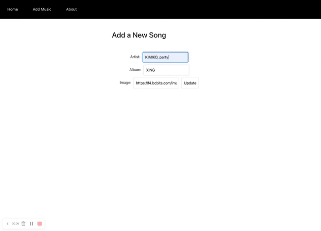
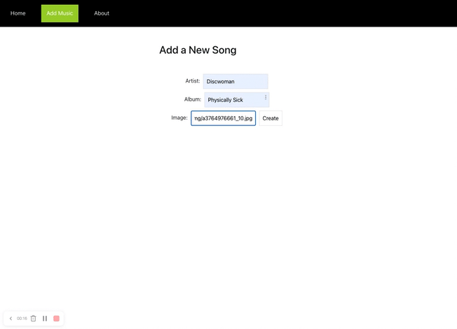
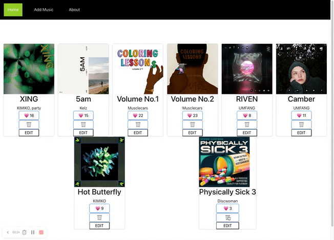

# Studio Ghibli-App

## Repository URL

https://github.com/marskimiko/studioghibli-app

## Project Philosophy:

This project was made with the intention of providing a space where you can easily access all of the different Studio Ghibli Films and information about.

I was inspired to make this application as a lover Hayao Miyazaki's films and the fact that he is about to release his last film and it was imporant to me to to have a place to go where I read more about them. 

## Features: 

- Displays a list of all Studio Ghibli films
- Provides description, release date, run time, and rotten tomato score for each film
- Can add films that may not be listed

## Description of app: 

This application is a database of Studio Ghibli Films. It uses a public API of a list of Studio Ghibli films to fetch the data : https://ghibliapi.herokuapp.com/films

The event listeners used in this application are DOMContentLoaded two click events, as well as a submit event. 

Upon clicking on the film the page then loads the name of the film, its description, date of release and rotten tomato score. In order to return to the full list of films you can click on the "All Films" button at the top of the page. You can also add a film to the list if there is anything missing by clicking the "Add Missing Film!" button which triggers a form to appear on the page where you can enter the missing information.

## How to Use:

**•** Click on a the heart to add more likes and click the edit button to enter information about the album of your choice

**Step 2:** Click on the "All Films" button to return to the full list of films

**Step 3:** If you think that there is a missing film from the list click on the "Add a missing film!" button and a form where you can submit the film will appear

**Step 4:** Once you have entered a film name click the "Add Film" button and a fill will be added to the list

## Technologies used:

- Vanilla JavaScript
- HTML
- CSS
- Ghibli api
# Getting Started with Create React App

This project was bootstrapped with [Create React App](https://github.com/facebook/create-react-app).

## Available Scripts

In the project directory, you can run:

### `npm start`

Runs the app in the development mode.\
Open [http://localhost:3000](http://localhost:3000) to view it in your browser.

The page will reload when you make changes.\
You may also see any lint errors in the console.

### `npm test`

Launches the test runner in the interactive watch mode.\
See the section about [running tests](https://facebook.github.io/create-react-app/docs/running-tests) for more information.

### `npm run build`

Builds the app for production to the `build` folder.\
It correctly bundles React in production mode and optimizes the build for the best performance.

The build is minified and the filenames include the hashes.\
Your app is ready to be deployed!

See the section about [deployment](https://facebook.github.io/create-react-app/docs/deployment) for more information.

### `npm run eject`

**Note: this is a one-way operation. Once you `eject`, you can't go back!**

If you aren't satisfied with the build tool and configuration choices, you can `eject` at any time. This command will remove the single build dependency from your project.

Instead, it will copy all the configuration files and the transitive dependencies (webpack, Babel, ESLint, etc) right into your project so you have full control over them. All of the commands except `eject` will still work, but they will point to the copied scripts so you can tweak them. At this point you're on your own.

You don't have to ever use `eject`. The curated feature set is suitable for small and middle deployments, and you shouldn't feel obligated to use this feature. However we understand that this tool wouldn't be useful if you couldn't customize it when you are ready for it.

## Learn More

You can learn more in the [Create React App documentation](https://facebook.github.io/create-react-app/docs/getting-started).

To learn React, check out the [React documentation](https://reactjs.org/).

### Code Splitting

This section has moved here: [https://facebook.github.io/create-react-app/docs/code-splitting](https://facebook.github.io/create-react-app/docs/code-splitting)

### Analyzing the Bundle Size

This section has moved here: [https://facebook.github.io/create-react-app/docs/analyzing-the-bundle-size](https://facebook.github.io/create-react-app/docs/analyzing-the-bundle-size)

### Making a Progressive Web App

This section has moved here: [https://facebook.github.io/create-react-app/docs/making-a-progressive-web-app](https://facebook.github.io/create-react-app/docs/making-a-progressive-web-app)

### Advanced Configuration

This section has moved here: [https://facebook.github.io/create-react-app/docs/advanced-configuration](https://facebook.github.io/create-react-app/docs/advanced-configuration)

### Deployment

This section has moved here: [https://facebook.github.io/create-react-app/docs/deployment](https://facebook.github.io/create-react-app/docs/deployment)

### `npm run build` fails to minify

This section has moved here: [https://facebook.github.io/create-react-app/docs/troubleshooting#npm-run-build-fails-to-minify](https://facebook.github.io/create-react-app/docs/troubleshooting#npm-run-build-fails-to-minify)
