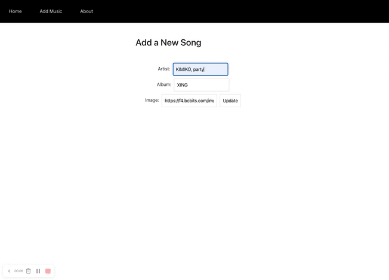
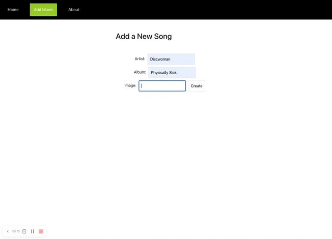
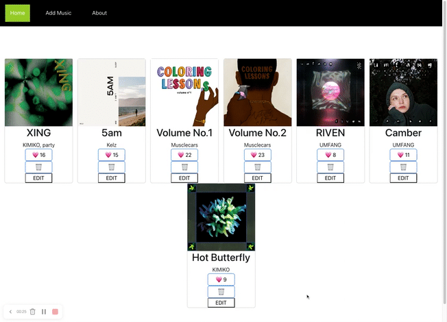

# Music Project Database

## Repository URL

https://github.com/marskimiko/studioghibli-app

## Project Philosophy:

My idea for this project was to create a music project database for me to store various projects that I have worked on over the years as an audio engineer, as well as to a place for me to add additional projects that I work on in the future. 

I was inspired to make this project because as an audio engineer it can be hard to keep track of all of the different projects that you've worked on and I thought it would be helpful to be able to create something that I can easily continue to add to as time goes on. 

## Features: 

- The home page displays all of the music projects that I have worked on over the years 
- On the home page you have the ability to like the albums, delete them from the browser, as well as edit the information displayed about them on the page
- Upon clicking on the "edit" button the user will be taken to a form where they can edit information, and then click the "update" button which will automatically link them back to the home page where they can see the changes they made displayed in the browerser
- In the nav bar you can click on the "Add Music" button to add more projects to the home page. Upon clicking you will automatically be taken to a form where you can enter information about the project you are adding. Click on the "create" button to automatically be linked to the home page and see the new project in the browser. These projects can also be liked, deleted, and edited as desired
- You can also click the about button in the nav bar to be linked to the about page providing information about the developer as well as a link to more projects that they have worked on

## Description of app: 

This is a single page application that is a database of music projects that Marisa Kimiko Saunders has worked on over the years. It uses a public JSON server to store the data which is then fetched from : http://localhost:3004/music

The application uses a total of 6 components: App.js, Home.js, MusicCard.js, Form.js, NavBar.js, and About.js

The application has 5 different client-side routes throughout it using React-Router: Home, Add, Edit, and About

The application uses GET, POST, PATCH, and DELETE requests in the code.

The GET request is used to fetch the data from the db.json file using the JSON server to display the different projects in the browser. 

The POST request is used in the form in order to add more projects to the home page.

Two PATCH requests are used in the like feature to add more likes, as well as the update feature to edit the projects on the home page.

The DELETE request is used to delete projects from the home page. 

Styling was done with css using both styled components and a CSS file, as well as Bootstrap.

## How to Use:

**•** Click the 💗 button to increase the number of likes. You can also click the edit button which will take you to a form to edit the project you selected

**•** Once you have selected a project to edit you can fill out the form

**•** Once you are done filling out the form click "update" button to see the updated project in the browser

**•** You can also click the "Add Music" button in the nav bar which will take you to a new form to fill out

**•** Once you are done filling out the form click the "create" button to see the new project in the browser. Just like the other projects you can add more and edit the new project information

**•** If you want to delete a project from the browser click the 🗑 icon

**•** Click the "about" button in the nav bar to learn about the developer, there is also a link to their git hub if you'd like to see more of their projects

## Technologies used:

- React
- Javascript
- HTML
- CSS
- Bootstrap
- JSON server
- React Router
- Create-react-app

### Advanced Configuration

This section has moved here: [https://facebook.github.io/create-react-app/docs/advanced-configuration](https://facebook.github.io/create-react-app/docs/advanced-configuration)

### Deployment

This section has moved here: [https://facebook.github.io/create-react-app/docs/deployment](https://facebook.github.io/create-react-app/docs/deployment)

### `npm run build` fails to minify

This section has moved here: [https://facebook.github.io/create-react-app/docs/troubleshooting#npm-run-build-fails-to-minify](https://facebook.github.io/create-react-app/docs/troubleshooting#npm-run-build-fails-to-minify)
